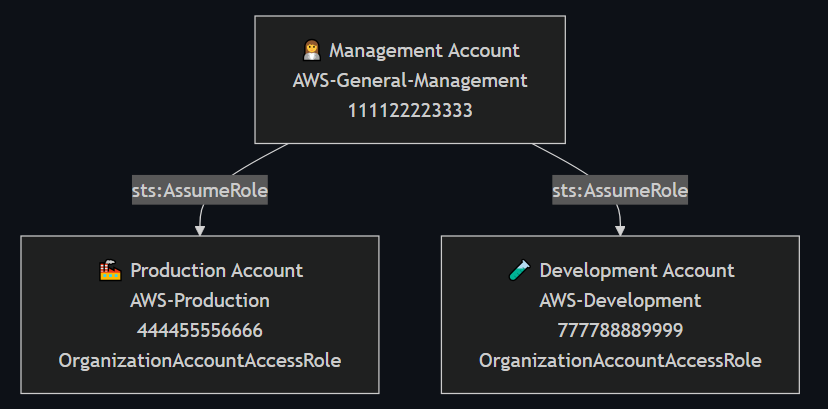
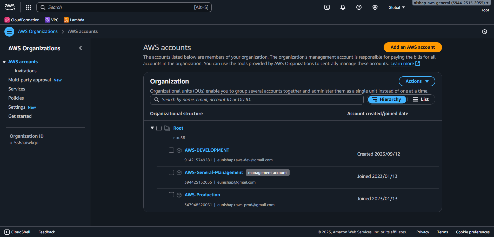
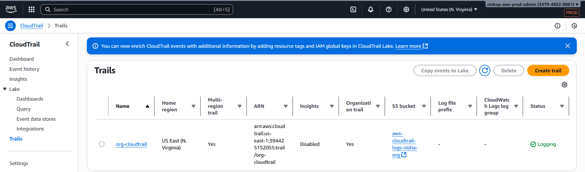
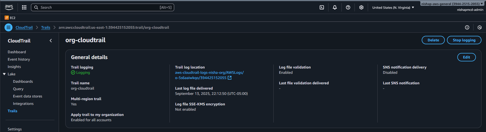
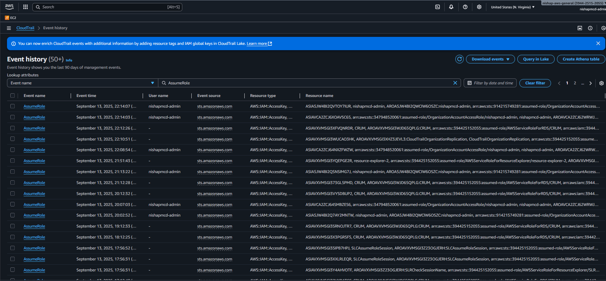

<p align="center">
  
</p>

<h1 align="center">AWS Organizations: Multi-Account Governance Lab</h1>

<p align="center">
  <strong>Environment Isolation • Centralized Governance • RMF-Aligned Security</strong>
</p>

<p align="center">
  <a href="https://aws.amazon.com/organizations/">
    
  </a>
  <a href="https://csrc.nist.gov/publications/detail/sp/800-53/rev-5/final">
    
  </a>
  
  
</p>


## 🖼️ Architecture

<!-- Architecture Diagram -->
<p align="center">
  
  <br>
  <em>Figure 1 — AWS Organizations Multi-Account Architecture</em>
</p>

---

### 📎 Evidence — Organization Hierarchy

**Objective:** Show that the AWS Organization structure includes a Management account and two member accounts (Production and Development), supporting account management and environment isolation.

**Relevant Controls:**  
- **AC-2 (CCI-000015)** – Account management  
- **PL-8 (CCI-002450)** – Security architecture  

<p align="center">
  
  <br>
  <em>Figure 2 — AWS Console view showing Management, Production, and Development accounts</em>
</p>


---

## 📌 Overview
This lab demonstrates how to build a secure multi-account AWS environment using **AWS Organizations**.  
It implements a **Management account**, a **Production account**, and a **Development account** to support environment isolation, centralized governance, and cross-account administrative access.

**Key Learning Objectives**
- Create and manage multiple AWS accounts using AWS Organizations
- Establish secure cross-account access using IAM role trust policies
- Apply security architecture principles: separation of duties, least privilege, and centralized logging
- Map hands-on AWS implementation to NIST RMF controls

---

## 📁 Repository Structure

```plaintext
AWS-Repo/
└── AWS Organizations - Multi-Account Lab/
    ├── README.md                      # Main lab guide
    ├── rmf-mapping.md                 # RMF control-to-CCI mapping
    ├── trust-policies/                # JSON trust policy exports
    │   ├── management-to-prod.json
    │   └── management-to-dev.json
    └── screenshots/                   # Evidence screenshots
        ├── aws-console-org-hierarchy.png
        ├── role-prod-trust-policy.png
        ├── role-dev-trust-policy.png
        ├── role-switch-success-prod.png
        ├── role-switch-success-dev.png
        ├── cloudtrail-org-trail.png
        ├── cloudtrail-trail-config.png
        ├── cloudtrail-assumerole-events.png
        ├── cloudtrail-lake-query.png
        └── cloudtrail-lake-results.png

```

---

## ⚙️ Implementation Steps

### 1. Create the AWS Organization
- Enable AWS Organizations in the Management account
- Invite or create member accounts (Production and Development)

### 2. Verify Role Creation
- Confirm that each member account automatically created the `OrganizationAccountAccessRole`

### 3. Establish Cross-Account Access
- From the Management account, create a **Switch Role** profile for both Prod and Dev accounts
- Verify trust policy (example):

```json
{
    "Version": "2012-10-17",
    "Statement": [
        {
            "Effect": "Allow",
            "Principal": {
                "AWS": "arn:aws:iam::394425152055:root"
            },
            "Action": "sts:AssumeRole"
        }
    ]
}

```
---
### 4. Test Role Switching

- Log in as an IAM user in the Management account  
- Switch into the `OrganizationAccountAccessRole` for the Prod account  
- Switch into the `OrganizationAccountAccessRole` for the Dev account  
- Confirm you can switch back to your Management IAM user session

### 📎 Evidence — Role Switching

**Objective:** Demonstrate successful cross-account access from the Management account into the Production and Development accounts via the `OrganizationAccountAccessRole`.

<p align="center">
  
  <br>
  <em>Figure 3 — Successfully switched from Management IAM user into the Production account</em>
</p>

<p align="center">
  
  <br>
  <em>Figure 4 — Successfully switched from Management IAM user into the Development account</em>
</p>

---

### 📎 Evidence — OrganizationAccountAccessRole Trust Policies

**Objective:** Confirm that each member account created an `OrganizationAccountAccessRole` and that its trust policy allows assumption by the Management account.

<p align="center">
  
  <br>
  <em>Figure 5 — Trust policy in the Production account allows access from the Management account</em>
</p>

<p align="center">
  
  <br>
  <em>Figure 6 — Trust policy in the Development account allows access from the Management account</em>
</p>


---

## ⚡ Step 5 – Enable CloudTrail for Organization-Wide Logging

**🎯 Objective**

- Collect audit logs from all accounts (Management, Production, Development)
- Record `AssumeRole` and `SwitchRole` events to demonstrate access accountability
- Satisfies **AU-2 (CCI-000126)** and **AU-12 (CCI-001464)**

**🛠️ Implementation**

- **In the Management account**
  - Go to **CloudTrail → Trails → Create trail**
  - Name: `org-cloudtrail`
  - Apply trail to **organization**
  - Choose a new or existing **S3 bucket** for centralized logging
  - Enable:
    - **Management events** (Read/Write)
    - *(Optional)* Data events
    - *(Optional)* Insights events
  - Enable **log file validation**

- **In the Production and Development accounts**
  - Go to **CloudTrail → Trails**
  - Confirm `org-cloudtrail` appears as an organization-level trail

- **Generate events**
  - Switch from the Management account into Prod and Dev using `OrganizationAccountAccessRole`
  - Wait a few minutes, then return to **CloudTrail → Event history**
  - Filter for `AssumeRole` events

### 📎 Evidence — CloudTrail Lake Query Results

<p align="center">
  
  <br>
  <em>Figure 7 — CloudTrail trail org-cloudtrail applied org-wide</em>
</p>

<p align="center">
  
  <br>
  <em>Figure 8 — Trail configuration showing log validation and S3 bucket logging</em>
</p>

<p align="center">
  
  <br>
  <em>Figure 9 — CloudTrail Event history showing AssumeRole events captured</em>
</p>

---

---

## 📊 Step 6 – Verify AssumeRole Events Using CloudTrail Lake

**🎯 Objective**

- Confirm that cross-account role assumption events are logged centrally
- Demonstrate auditing and monitoring capabilities
- Satisfies **AU-2 (CCI-000126)** and **AU-12 (CCI-001464)**

**🛠️ Implementation**

- **In the Management account**
  - Go to **CloudTrail → Lake → Query editor**
  - Paste and run the SQL query below

```sql
SELECT 
  eventTime,
  eventName,
  userIdentity.arn,
  requestParameters.roleArn,
  sourceIPAddress,
  awsRegion
FROM 
  awscloudtraillake
WHERE 
  eventSource = 'sts.amazonaws.com'
  AND eventName = 'AssumeRole'
  AND requestParameters.roleArn LIKE '%OrganizationAccountAccessRole%'
ORDER BY eventTime DESC
LIMIT 25;
```

**Review the Results**

- Confirm the following appear in your results:
  - `userIdentity.arn` matches your IAM user in the Management account
  - `requestParameters.roleArn` shows your Production and Development `OrganizationAccountAccessRole`
  - Timestamps align with when you switched roles

### 📎 Evidence — CloudTrail Lake Query Results

**Objective:** Demonstrate that cross-account `AssumeRole` activity from the Management account into the Production and Development accounts is logged and queryable using CloudTrail Lake.

**Relevant Controls:**  
- **AU-2 (CCI-000126)** — Event logging  
- **AU-12 (CCI-001464)** — Audit record generation  

<p align="center">
  
  <br>
  <em>Figure 9 — CloudTrail Lake query used to locate cross-account AssumeRole events</em>
</p>

<p align="center">
  
  <br>
  <em>Figure 10 — Query results showing Management IAM user assuming Prod and Dev roles</em>
</p>


📎 Evidence Manifest

| Figure  | Filename                           | Description                                                                     | Supports Control(s) |
| ------- | ---------------------------------- | ------------------------------------------------------------------------------- | ------------------- |
| Fig. 1  | `organizations-01.PNG`             | AWS Organizations Multi-Account Architecture diagram                            | PL-8                |
| Fig. 2  | `aws-console-org-hierarchy.png`    | AWS Organizations console showing Management, Production, Development accounts  | AC-2, PL-8          |
| Fig. 3  | `role-switch-success-prod.png`     | Switched from Management IAM user into Production account                       | AC-5, AC-6, IA-2    |
| Fig. 4  | `role-switch-success-dev.png`      | Switched from Management IAM user into Development account                      | AC-5, AC-6, IA-2    |
| Fig. 5  | `role-prod-trust-policy.png`       | Trust policy for `OrganizationAccountAccessRole` in Production                  | AC-3, AC-6          |
| Fig. 6  | `role-dev-trust-policy.png`        | Trust policy for `OrganizationAccountAccessRole` in Development                 | AC-3, AC-6          |
| Fig. 7  | `cloudtrail-org-trail.png`         | CloudTrail trail `org-cloudtrail` applied org-wide                              | AU-2, AU-12         |
| Fig. 8  | `cloudtrail-trail-config.png`      | Trail configuration showing log validation and S3 bucket logging                | AU-2, AU-12         |
| Fig. 9  | `cloudtrail-assumerole-events.png` | CloudTrail Event history showing `AssumeRole` events captured                   | AU-2, AU-12         |
| Fig. 10 | `cloudtrail-lake-query.png`        | CloudTrail Lake query editor with SQL to locate `AssumeRole` events             | AU-2, AU-12         |
| Fig. 11 | `cloudtrail-lake-results.png`      | CloudTrail Lake query results showing Management IAM user assuming member roles | AU-2, AU-12         |


## 🛡️ Security & RMF Control Mapping

| Control | CCI         | Description                                                              |
| ------- | ------------| ------------------------------------------------------------------------ |
| AC-2    | CCI-000015  | Account management: Creates and manages organizational accounts          |
| AC-3    | CCI-000213  | Access enforcement: Trust policy limits access to the Management account |
| AC-5    | CCI-000770  | Separation of duties: Isolates environments and admin privileges         |
| AC-6    | CCI-000366  | Least privilege: Only temporary elevation via role assumption            |
| IA-2    | CCI-000764  | Identification & authentication: IAM user auth before assuming roles     |
| AU-2    | CCI-000126  | Event logging: CloudTrail logs all cross-account access events           |
| AU-12   | CCI-001464  | Audit record generation: CloudTrail generates immutable logs             |
| PL-8    | CCI-002450  | Security architecture: Implements multi-account isolation                |

See the full mapping in [rmf-mapping.md](./rmf-mapping.md)


📝 Notes

This lab is for personal professional development and is not part of a formal RMF package.

Future improvements may include adding SCPs for additional guardrails and enabling centralized logging to an S3 bucket.
