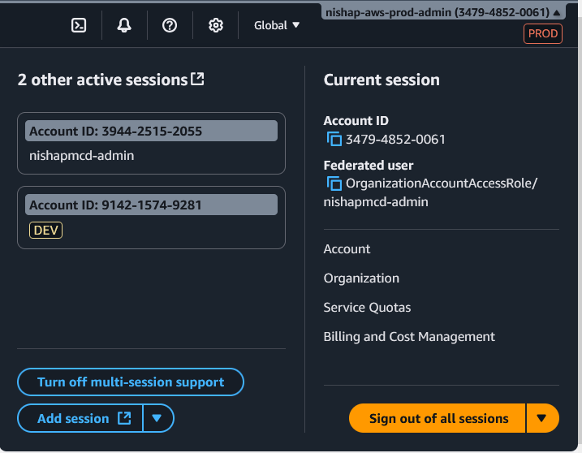
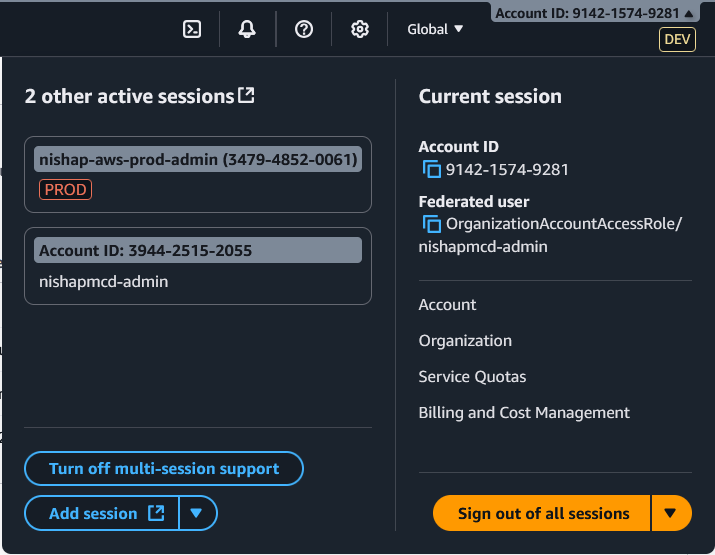
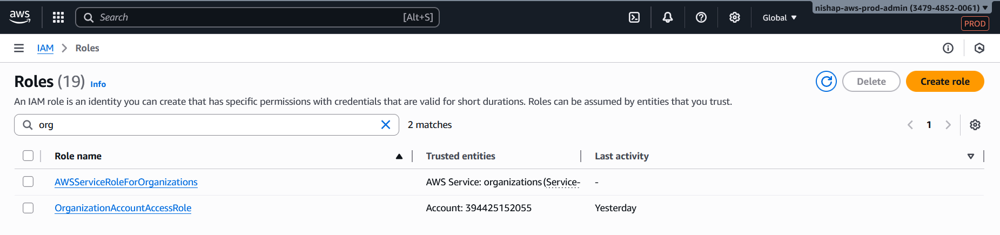
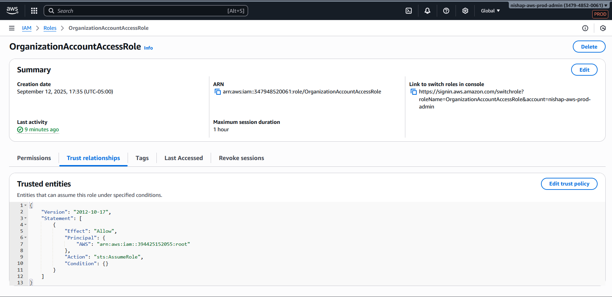
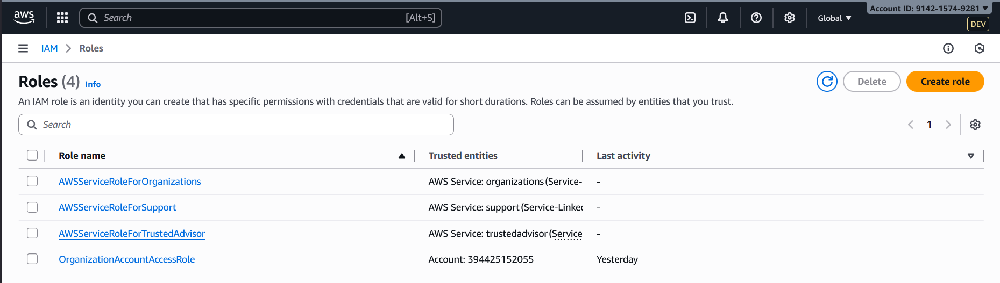
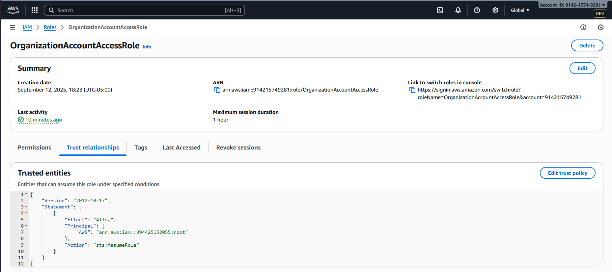

<p align="center">
  
</p>

<h1 align="center">AWS Organizations: Multi-Account Governance Lab</h1>

<p align="center">
  <strong>Environment Isolation • Centralized Governance • RMF-Aligned Security</strong>
</p>

<p align="center">
  <a href="https://aws.amazon.com/organizations/">
    
  </a>
  <a href="https://csrc.nist.gov/publications/detail/sp/800-53/rev-5/final">
    
  </a>
  
  
</p>

---

## 📌 Overview
This lab demonstrates how to build a secure multi-account AWS environment using **AWS Organizations**.  
It implements a **Management account**, a **Production account**, and a **Development account** to support environment isolation, centralized governance, and cross-account administrative access.

**Key Learning Objectives**
- Create and manage multiple AWS accounts using AWS Organizations
- Establish secure cross-account access using IAM role trust policies
- Apply security architecture principles: separation of duties, least privilege, and centralized logging
- Map hands-on AWS implementation to NIST RMF controls

---

## 📁 Repository Structure

```plaintext
AWS-Repo/
└── AWS Organizations - Multi-Account Lab/
    ├── README.md                  # This lab guide
    ├── rmf-mapping.md              # Control mapping to NIST SP 800-53 Rev 5 CCIs
    ├── trust-policies/
    │   ├── management-to-prod.json
    │   └── management-to-dev.json
    └── screenshots/
        ├── organizations-01.PNG   # Architecture diagram
        ├── role-switch-success.png
        └── cloudtrail-assumerole.png
```
---

## 🖼️ Architecture

<p align="center">
  
  <br>
  <em>Figure 1 — AWS Organizations Multi-Account Architecture</em>
</p>

---

## ⚙️ Implementation Steps

### 1. Create the AWS Organization
- Enable AWS Organizations in the Management account
- Invite or create member accounts (Production and Development)

### 2. Verify Role Creation
- Confirm that each member account automatically created the `OrganizationAccountAccessRole`

### 3. Establish Cross-Account Access
- From the Management account, create a **Switch Role** profile for both Prod and Dev accounts
- Verify trust policy (example):

```json
{
    "Version": "2012-10-17",
    "Statement": [
        {
            "Effect": "Allow",
            "Principal": {
                "AWS": "arn:aws:iam::394425152055:root"
            },
            "Action": "sts:AssumeRole"
        }
    ]
}

```

### 4. Test Role Switching

- Log in as an IAM user in the Management account  
- Switch into the `OrganizationAccountAccessRole` for the Prod account  
- Switch into the `OrganizationAccountAccessRole` for the Dev account  
- Confirm you can switch back to your Management IAM user session

### 📎 Evidence to Capture — Role Switching

**Objective:** Demonstrate successful cross-account access from the Management account into the Production and Development accounts via the `OrganizationAccountAccessRole`.

<p align="center">
  
  <br>
  <em>Figure 2 — Successfully switched from Management into the Production account</em>
</p>

<p align="center">
  
  <br>
  <em>Figure 3 — Successfully switched from Management into the Development account</em>
</p>

### 📎 Evidence to Capture — OrganizationAccountAccessRole Trust Policies

**Objective:** Confirm that each member account created an `OrganizationAccountAccessRole` and that its trust policy allows assumption by the Management account.

<p align="center">
  
  
  <br>
  <em>Figure 4 — Trust policy in the Production account allows access from the Management account</em>
</p>

<p align="center">
  
  
  <br>
  <em>Figure 5 — Trust policy in the Development account allows access from the Management account</em>
</p>


---

## ⚡ Step 5 – Enable CloudTrail for Organization-Wide Logging

This step configures **centralized CloudTrail logging** from your Management account to capture all activity across your AWS Organization, including cross-account role assumption events.

### 🎯 Objective

- Collect audit logs from all accounts (Management, Production, Development)
- Record `AssumeRole` and `SwitchRole` events to demonstrate access accountability
- Satisfy **AU-2 (CCI-000126)** and **AU-12 (CCI-001464)** requirements

### 🛠️ Implementation Steps

1. **Sign in to the Management Account**
   - Use your IAM user or root credentials for the Management account.

2. **Create an Organization Trail**
   - Open **CloudTrail → Trails → Create trail**
   - Name the trail: `org-cloudtrail`
   - Apply trail to **organization**
   - Choose **Create a new S3 bucket** or select an existing centralized logging bucket
   - Enable:
     - **Management events** (Read/Write)
     - **Data events** (optional but recommended later)
     - **Insights events** (optional)

3. **Enable Log File Validation**
   - On the same page, enable log file validation to ensure logs are tamper-evident.

4. **Verify in Member Accounts**
   - Log in to the Production and Development accounts
   - Go to **CloudTrail → Trails**
   - Confirm `org-cloudtrail` appears as an organization-level trail and is delivering logs

5. **Generate Events**
   - Switch from the Management account into the Production and Development accounts using your `OrganizationAccountAccessRole`
   - Wait a few minutes, then return to CloudTrail in the Management account
   - Filter for `AssumeRole` events to confirm they are logged

### 📎 Evidence to Capture

- Screenshot of the `org-cloudtrail` trail showing it is applied to the entire Organization
- Screenshot of CloudTrail `AssumeRole` events from Management to Production and Development
- Screenshot of the S3 bucket showing CloudTrail log delivery

---

## 📊 Step 6 – Verify AssumeRole Events Using CloudTrail Lake

This step confirms that your cross-account role switching activity is being logged.  
You will query the centralized CloudTrail logs to locate `AssumeRole` events from your Management account into your Production and Development accounts.

### 🎯 Objective

- Validate that `AssumeRole` events are recorded for all cross-account administrative actions  
- Demonstrate centralized auditing and monitoring  
- Satisfy **AU-2 (CCI-000126)** and **AU-12 (CCI-001464)** requirements

### 🛠️ Implementation Steps

1. **Open CloudTrail Lake**
   - In the Management account, go to **CloudTrail → Lake → Query editor**

2. **Run the SQL Query**
   - Paste and run the following query to retrieve your `AssumeRole` events:

```sql
SELECT 
  eventTime,
  eventName,
  userIdentity.principalId,
  userIdentity.arn,
  requestParameters.roleArn,
  sourceIPAddress,
  awsRegion
FROM 
  awscloudtraillake
WHERE 
  eventSource = 'sts.amazonaws.com'
  AND eventName = 'AssumeRole'
  AND requestParameters.roleArn LIKE '%OrganizationAccountAccessRole%'
ORDER BY eventTime DESC
LIMIT 25;
```

### 3. Review the Results

- Confirm the following appear in your results:
  - `userIdentity.arn` matches your IAM user in the Management account
  - `requestParameters.roleArn` shows your Production and Development `OrganizationAccountAccessRole`
  - Timestamps align with when you switched roles

### 📎 Evidence to Capture

- Screenshot of the query results showing your Management IAM user assuming the Prod and Dev roles
- Highlighted fields: `eventTime`, `userIdentity.arn`, and `requestParameters.roleArn`


## 🛡️ Security & RMF Control Mapping

| Control | CCI         | Description                                                              |
| ------- | ------------| ------------------------------------------------------------------------ |
| AC-2    | CCI-000015  | Account management: Creates and manages organizational accounts          |
| AC-3    | CCI-000213  | Access enforcement: Trust policy limits access to the Management account |
| AC-5    | CCI-000770  | Separation of duties: Isolates environments and admin privileges         |
| AC-6    | CCI-000366  | Least privilege: Only temporary elevation via role assumption            |
| IA-2    | CCI-000764  | Identification & authentication: IAM user auth before assuming roles     |
| AU-2    | CCI-000126  | Event logging: CloudTrail logs all cross-account access events           |
| AU-12   | CCI-001464  | Audit record generation: CloudTrail generates immutable logs             |
| PL-8    | CCI-002450  | Security architecture: Implements multi-account isolation                |

See the full mapping in [rmf-mapping.md](./rmf-mapping.md)


📝 Notes

This lab is for personal professional development and is not part of a formal RMF package.

Future improvements may include adding SCPs for additional guardrails and enabling centralized logging to an S3 bucket.
