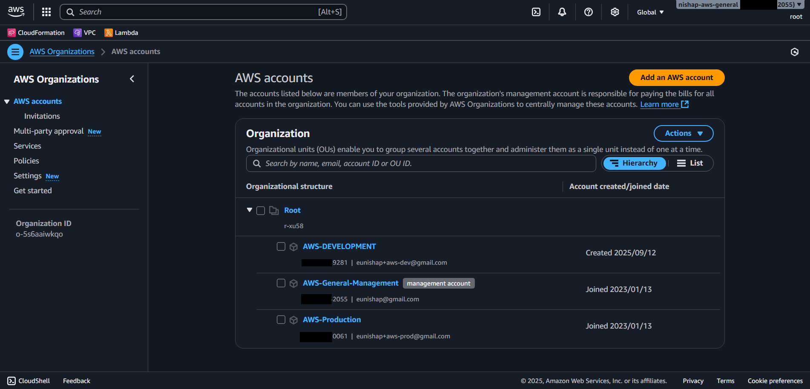

<p align="center">
  
</p>

<h1 align="center">AWS Organizations: Multi-Account Governance Lab</h1>

<p align="center">
  <strong>Environment Isolation • Centralized Governance • RMF-Aligned Security</strong>
</p>

<p align="center">
  <a href="https://aws.amazon.com/organizations/">
    
  </a>
  <a href="https://csrc.nist.gov/publications/detail/sp/800-53/rev-5/final">
    
  </a>
  
  
</p>


## 🖼️ Architecture

<!-- Architecture Diagram -->
<p align="center">
  
  <br>
  <em>AWS Organizations Multi-Account Architecture</em>
</p>

---

### 📎 Evidence — Organization Hierarchy

**Objective:** Show that the AWS Organization structure includes a Management account and two member accounts (Production and Development), supporting account management and environment isolation.

**Relevant Controls:**  
- **AC-2 (CCI-000015)** – Account management  
- **PL-8 (CCI-002450)** – Security architecture  

<p align="center">
  
  <br>
  <em>AWS Console view showing Management, Production, and Development accounts</em>
</p>

---

## 📌 Overview

This lab demonstrates how to build a secure multi-account AWS environment using **AWS Organizations**.  
It implements a **Management account**, a **Production account**, and a **Development account** to support environment isolation, centralized governance, and cross-account administrative access.

**Key Learning Objectives**
- Create and manage multiple AWS accounts using AWS Organizations
- Establish secure cross-account access using IAM role trust policies
- Apply security architecture principles: separation of duties, least privilege, and centralized logging
- Map hands-on AWS implementation to NIST RMF controls

---

## 📁 Repository Structure

```plaintext
AWS-Repo/
└── AWS Organizations - Multi-Account Lab/
    ├── README.md                          # Main lab guide
    ├── rmf-mapping.md                     # RMF control-to-CCI mapping
    ├── diagrams/                          # Visual architecture assets
    │   ├── architecture-banner.png
    │   └── architecture-diagram.png
    ├── trust-policies/                    # JSON exports of IAM role trust policies
    │   ├── management-to-prod.json
    │   └── management-to-dev.json
    ├── cloudtrail-lake-queries/            # CloudTrail Lake SQL used for evidence
    │   ├── assume-role-events.sql
    │   ├── session-issuer.sql
    │   ├── assume-role-ip-region.sql
    │   ├── assume-role-access-denied.sql
    │   └── assume-role-count-by-user.sql
    ├── query-results/                      # CSV results from CloudTrail Lake (account IDs masked)
    │   ├── assume-role-events.csv
    │   ├── session-issuer.csv
    │   ├── assume-role-ip-region.csv
    │   ├── assume-role-access-denied.csv
    │   └── assume-role-count-by-user.csv
    └── screenshots/                        # Visual evidence used in README
        ├── aws-console-org-hierarchy.png
        ├── role-prod-trust-policy.png
        ├── role-dev-trust-policy.png
        ├── role-switch-success-prod.png
        ├── role-switch-success-dev.png
        ├── cloudtrail-org-trail.png
        ├── cloudtrail-trail-config.png
        ├── cloudtrail-assumerole-events.png
        ├── cloudtrail-lake-query.png
        └── cloudtrail-lake-results.png
```

---

## ⚙️ Implementation Steps
The following steps walk through the full implementation of the AWS Organizations lab.

### 1. Create the AWS Organization
- Enable AWS Organizations in the Management account
- Invite or create member accounts (Production and Development)

### 2. Verify Role Creation
- Confirm that each member account automatically created the `OrganizationAccountAccessRole`

### 3. Establish Cross-Account Access
- From the Management account, create a **Switch Role** profile for both Prod and Dev accounts
- Verify trust policy (example):

```json
{
    "Version": "2012-10-17",
    "Statement": [
        {
            "Effect": "Allow",
            "Principal": {
                "AWS": "arn:aws:iam::XXXXXXXX2055:root"
            },
            "Action": "sts:AssumeRole"
        }
    ]
}

```
---
### 4. Test Role Switching

- Log in as an IAM user in the Management account  
- Switch into the `OrganizationAccountAccessRole` for the Prod account  
- Switch into the `OrganizationAccountAccessRole` for the Dev account  
- Confirm you can switch back to your Management IAM user session

### 📎 Evidence — Role Switching

<p align="center">
  
  <br>
  <em>Successfully switched from Management IAM user into the Production account</em>
</p>

<p align="center">
  
  <br>
  <em>Successfully switched from Management IAM user into the Development account</em>
</p>

---

### 📎 Evidence — OrganizationAccountAccessRole Trust Policies

<p align="center">
  
  <br>
  <em>Trust policy in the Production account allows access from the Management account</em>
</p>

<p align="center">
  
  <br>
  <em>Trust policy in the Development account allows access from the Management account</em>
</p>


---

## ⚡ Step 5 – Enable CloudTrail for Organization-Wide Logging

**🎯 Objective**

- Collect audit logs from all accounts (Management, Production, Development)
- Record `AssumeRole` and `SwitchRole` events to demonstrate access accountability
- Satisfies **AU-2 (CCI-000126)** and **AU-12 (CCI-001464)**

**🛠️ Implementation**

- **In the Management account**
  - Go to **CloudTrail → Trails → Create trail**
  - Name: `org-cloudtrail`
  - Apply trail to **organization**
  - Choose a new or existing **S3 bucket** for centralized logging
  - Enable:
    - **Management events** (Read/Write)
    - *(Optional)* Data events
    - *(Optional)* Insights events
  - Enable **log file validation**

- **In the Production and Development accounts**
  - Go to **CloudTrail → Trails**
  - Confirm `org-cloudtrail` appears as an organization-level trail

- **Generate events**
  - Switch from the Management account into Prod and Dev using `OrganizationAccountAccessRole`
  - Wait a few minutes, then return to **CloudTrail → Event history**
  - Filter for `AssumeRole` events

---

## 📊 Step 6 – Verify AssumeRole Events Using CloudTrail Lake

**🎯 Objective**

- Confirm that cross-account role assumption events are logged centrally
- Demonstrate auditing and monitoring capabilities
- Satisfies **AU-2 (CCI-000126)** and **AU-12 (CCI-001464)**

**🛠️ Implementation**

- **In the Management account**
  - Go to **CloudTrail → Lake → Query editor**
  - Paste and run your queries from cloudtrail-lake-queries/ (replace EDS ID placeholder)

**Review the Results**
- `userIdentity.arn` should match your Management IAM user
- `requestParameters.roleArn` should show the Production and Development `OrganizationAccountAccessRole`
- Timestamps should align with your test events


#### Visual Evidence
📎 Evidence Manifest — Visual Screenshots
| Filename                           | Description                                                                     | Supports Control(s) |
| ---------------------------------- | ------------------------------------------------------------------------------- | ------------------- |
| `organizations-01.PNG`             | AWS Organizations Multi-Account Architecture diagram                            | PL-8                |
| `aws-console-org-hierarchy.png`    | AWS Organizations console showing Management, Production, Development accounts  | AC-2, PL-8          |
| `role-switch-success-prod.png`     | Switched from Management IAM user into Production account                       | AC-5, AC-6, IA-2    |
| `role-switch-success-dev.png`      | Switched from Management IAM user into Development account                      | AC-5, AC-6, IA-2    |
| `role-prod-trust-policy.png`       | Trust policy for `OrganizationAccountAccessRole` in Production                  | AC-3, AC-6          |
| `role-dev-trust-policy.png`        | Trust policy for `OrganizationAccountAccessRole` in Development                 | AC-3, AC-6          |
| `cloudtrail-org-trail.png`         | CloudTrail trail `org-cloudtrail` applied org-wide                              | AU-2, AU-12         |
| `cloudtrail-trail-config.png`      | Trail configuration showing log validation and S3 bucket logging                | AU-2, AU-12         |
| `cloudtrail-assumerole-events.png` | CloudTrail Event history showing `AssumeRole` events captured                   | AU-2, AU-12         |
| `cloudtrail-lake-query.png`        | CloudTrail Lake query editor with SQL to locate `AssumeRole` events             | AU-2, AU-12         |
| `cloudtrail-lake-results.png`      | CloudTrail Lake query results showing Management IAM user assuming member roles | AU-2, AU-12         |

#### Query Evidence
📎 Evidence Manifest — Queries and Results
| Type                | File Name                                               | Description                                             | Supports Control(s) |
| ------------------- | ------------------------------------------------------- | ------------------------------------------------------- | ------------------- |
| SQL Query           | `cloudtrail-lake-queries/assume-role-events.sql`        | Lists all cross-account `AssumeRole` events             | AU-2, AU-12         |
| Query Results (CSV) | `query-results/assume-role-events.csv`                  | Results of cross-account `AssumeRole` events            | AU-2, AU-12         |
| SQL Query           | `cloudtrail-lake-queries/session-issuer.sql`            | Extracts session issuer user and principal IDs          | IA-2, AC-6          |
| Query Results (CSV) | `query-results/session-issuer.csv`                      | Shows Management IAM user assuming member roles         | IA-2, AC-6          |
| SQL Query           | `cloudtrail-lake-queries/assume-role-ip-region.sql`     | Shows `AssumeRole` events with source IP and AWS region | AC-6, AU-2          |
| Query Results (CSV) | `query-results/assume-role-ip-region.csv`               | Event source IPs and regions                            | AC-6, AU-2          |
| SQL Query           | `cloudtrail-lake-queries/assume-role-access-denied.sql` | Detects failed `AssumeRole` attempts                    | AC-3, AC-6, AU-2    |
| Query Results (CSV) | `query-results/assume-role-access-denied.csv`           | Denied cross-account attempts                           | AC-3, AC-6, AU-2    |
| SQL Query           | `cloudtrail-lake-queries/assume-role-count-by-user.sql` | Counts number of `AssumeRole` events per user           | AC-2, IA-2, AU-12   |
| Query Results (CSV) | `query-results/assume-role-count-by-user.csv`           | Role usage frequency per user                           | AC-2, IA-2, AU-12   |


## 🛡️ Security & RMF Control Mapping

| Control | CCI        | Description                                                              |
| ------- | ---------- | ------------------------------------------------------------------------ |
| AC-2    | CCI-000015 | Account management: Creates and manages organizational accounts          |
| AC-3    | CCI-000213 | Access enforcement: Trust policy limits access to the Management account |
| AC-5    | CCI-000770 | Separation of duties: Isolates environments and admin privileges         |
| AC-6    | CCI-000366 | Least privilege: Only temporary elevation via role assumption            |
| IA-2    | CCI-000764 | Identification & authentication: IAM user auth before assuming roles     |
| AU-2    | CCI-000126 | Event logging: CloudTrail logs all cross-account access events           |
| AU-12   | CCI-001464 | Audit record generation: CloudTrail generates immutable logs             |
| PL-8    | CCI-002450 | Security architecture: Implements multi-account isolation                |


---

## 📑 Full RMF Control Mapping

For detailed control-to-CCI mappings and how each requirement is satisfied in this lab,  
see the full [RMF Mapping Document](./rmf-mapping.md).


📝 Notes

This lab is for personal professional development and is not part of a formal RMF package.

Future improvements may include adding SCPs for additional guardrails and enabling centralized logging to an S3 bucket.
