# AWS Organizations: Multi-Account Governance Lab

## 📌 Overview
This lab demonstrates how to build a secure multi-account AWS environment using **AWS Organizations**.  
It implements a **Management account**, a **Production account**, and a **Development account** to support environment isolation, centralized governance, and cross-account administrative access.

**Key Learning Objectives**
- Create and manage multiple AWS accounts using AWS Organizations
- Establish secure cross-account access using IAM role trust policies
- Apply security architecture principles: separation of duties, least privilege, and centralized logging
- Map hands-on AWS implementation to NIST RMF controls

---

## 🖼️ Architecture

```mermaid
graph TD
    A[👩‍💼 Management Account<br/>AWS-General-Management<br/>111122223333]
    B[🏭 Production Account<br/>AWS-Production<br/>444455556666<br/>OrganizationAccountAccessRole]
    C[🧪 Development Account<br/>AWS-Development<br/>777788889999<br/>OrganizationAccountAccessRole]

    A -- sts:AssumeRole --> B
    A -- sts:AssumeRole --> C

    classDef mgmt fill:#1d4ed8,color:#fff,stroke:#0f172a,stroke-width:2px;
    classDef member fill:#0ea5e9,color:#fff,stroke:#0f172a,stroke-width:2px;
```


## ⚙️ Implementation Steps

### 1. Create the AWS Organization
- Enable AWS Organizations in the Management account
- Invite or create member accounts (Production and Development)

### 2. Verify Role Creation
- Confirm that each member account automatically created the `OrganizationAccountAccessRole`

### 3. Establish Cross-Account Access
- From the Management account, create a **Switch Role** profile for both Prod and Dev accounts
- Verify trust policy (example):

```json
{
  "Version": "2012-10-17",
  "Statement": [
    {
      "Effect": "Allow",
      "Principal": { "AWS": "arn:aws:iam::111122223333:root" },
      "Action": "sts:AssumeRole"
    }
  ]
}

```

### 4. Test Role Switching

- Log in as an IAM user in the Management account  
- Switch into the `OrganizationAccountAccessRole` for the Prod account  
- Switch into the `OrganizationAccountAccessRole` for the Dev account  
- Confirm you can switch back to your Management IAM user session

---
## ⚡ Step 5 – Enable CloudTrail for Organization-Wide Logging

This step configures **centralized CloudTrail logging** from your Management account to capture all activity across your AWS Organization, including cross-account role assumption events.

---

### 🎯 Objective

- Collect audit logs from all accounts (Management, Production, Development)
- Record `AssumeRole` and `SwitchRole` events to demonstrate access accountability
- Satisfy **AU-2 (CCI-000126)** and **AU-12 (CCI-001464)** requirements

---

### 🛠️ Implementation Steps

1. **Sign in to the Management Account**
   - Use your IAM user or root credentials for the Management account.

2. **Create an Organization Trail**
   - Open **CloudTrail → Trails → Create trail**
   - Name the trail: `org-cloudtrail`
   - Apply trail to **organization**
   - Choose **Create a new S3 bucket** or select an existing centralized logging bucket
   - Enable:
     - **Management events** (Read/Write)
     - **Data events** (optional but recommended later)
     - **Insights events** (optional)

3. **Enable Log File Validation**
   - On the same page, enable log file validation to ensure logs are tamper-evident.

4. **Verify in Member Accounts**
   - Log in to the Production and Development accounts
   - Go to **CloudTrail → Trails**
   - Confirm `org-cloudtrail` appears as an organization-level trail and is delivering logs

5. **Generate Events**
   - Switch from the Management account into the Production and Development accounts using your `OrganizationAccountAccessRole`
   - Wait a few minutes, then return to CloudTrail in the Management account
   - Filter for `AssumeRole` events to confirm they are logged

---

### 📎 Evidence to Capture

- Screenshot of the `org-cloudtrail` trail showing it is applied to the entire Organization
- Screenshot of CloudTrail `AssumeRole` events from Management to Production and Development
- Screenshot of the S3 bucket showing CloudTrail log delivery


---
📑 RMF Control Mapping
Control	CCI	How Satisfied
AU-2 – Event Logging	CCI-000126	CloudTrail records all management events including AssumeRole
AU-12 – Audit Record Generation	CCI-001464	CloudTrail automatically generates immutable audit records for cross-account access

---

## 📜 Verification

- Capture CloudTrail logs showing `AssumeRole` and `SwitchRole` events  
- Save screenshots of successful role switching  
- Document IAM trust policies used  

---

## 🛡️ Security & RMF Control Mapping

This lab demonstrates alignment to the following NIST SP 800-53 Rev 5 controls:

Control	Description

| Control | CCI        | Description                                                              |
| ------- | ---------- | ------------------------------------------------------------------------ |
| AC-2    | CCI-000015 | Account management: Creates and manages organizational accounts          |
| AC-3    | CCI-000213 | Access enforcement: Trust policy limits access to the Management account |
| AC-5    | CCI-000770 | Separation of duties: Isolates environments and admin privileges         |
| AC-6    | CCI-000366 | Least privilege: Only temporary elevation via role assumption            |
| IA-2    | CCI-000764 | Identification & authentication: IAM user auth before assuming roles     |
| AU-2    | CCI-000126 | Event logging: CloudTrail logs all cross-account access events           |
| PL-8    | CCI-002450 | Security architecture: Implements multi-account isolation                |


See the full mapping in rmf-mapping.md


📝 Notes

This lab is for personal professional development and is not part of a formal RMF package.

Future improvements may include adding SCPs for additional guardrails and enabling centralized logging to an S3 bucket.
