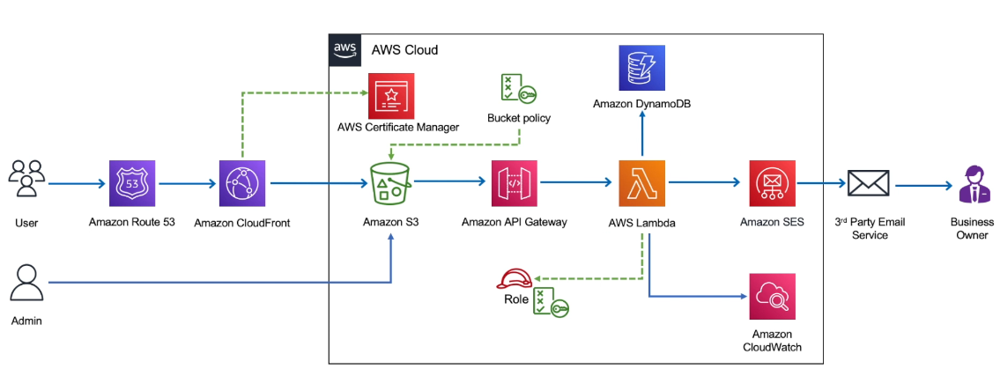

# Automated Contact Form Handling with AWS Serverless

## Overview
This project solves a common small-business problem: contact form submissions getting lost in email inboxes or tracked inconsistently.  

By automating the workflow with AWS serverless services, every submission is:  
- **Validated** to prevent bad input  
- **Stored in DynamoDB** for reliable, structured tracking  
- **Sent as an email notification via Amazon SES** (currently routed to Gmail, with future support for a validated domain identity)  

The result is a hands-off system where leads are captured instantly, stored safely, and delivered in real time — ensuring businesses never miss an opportunity.  

---

## Architecture


- **Amazon S3** – Hosts the static website and contact form  
- **Amazon API Gateway** – Exposes REST endpoints (`POST` for form submissions, `GET` for retrieving contacts)  
- **AWS Lambda** – Handles form logic  
  - `epicreads_contactus`: POST → validate input, write to DynamoDB, trigger SES email  
  - `epicreads_list_contacts`: GET → fetch submissions from DynamoDB  
- **Amazon DynamoDB** – Stores contact submissions  
- **Amazon SES** – Sends notifications (currently routed to Gmail; will be updated to a validated domain identity)  
- **Amazon CloudWatch** – Provides logging and monitoring  

---

## Workflow
1. **User submits form** on the static website hosted in S3.  
2. **API Gateway** invokes the appropriate Lambda function.  
3. **Lambda POST** stores the submission into **DynamoDB** and sends an **SES notification**.  
4. **Lambda GET** retrieves submissions for admin review.  
5. **CORS settings** ensure that only the approved website can call the API.  

---

## Problem → Approach → Result → Lesson
- **Problem:** Businesses with contact forms often face bottlenecks when leads are emailed manually or tracked inconsistently.  
- **Approach:** Build an automated, serverless workflow where form submissions go directly into DynamoDB via Lambda and API Gateway.  
- **Result:** Contacts are captured instantly, stored reliably, and retrievable through a secure API, improving responsiveness and eliminating manual errors.  
- **Lesson:** A serverless-first approach can drastically simplify operations while still providing scalability and integration opportunities (SES emails, analytics, etc.).  

---
## Roadmap
See [Next Steps](./docs/next-steps.md) for planned improvements and production hardening.

---
## Repo Structure
```plaintext
automated-contact-form-aws-serverless/
├── README.md                       # Main project overview
├── lambdas/
│   ├── contactus/                  # POST Lambda source
│   │   ├── index.js
│   │   └── package.json
│   └── list_contacts/              # GET Lambda source
│       ├── index.js
│       └── package.json
├── static-site/
│   ├── index.html                  # Landing page with form
│   ├── contacts.html               # Admin page to view leads
│   └── assets/
│       └── css/
│       └── js/
├── architecture/
│   └── architecture-diagram.png
├── docs/
│   ├── README.md                   # Detailed evidence walkthrough with screenshots
│   ├── screenshots/                
│   │   ├── form-submission.png
│   │   ├── dynamodb-entry.png
│   │   ├── api-gateway-test.png
│   │   ├── curl-response.png
│   │   ├── contacts-admin-page.png
│   │   └── ses-email.png           # SES → Gmail notification
│   └── next-steps.md               # Planned improvements (SES domain email, IAM auth, etc.)

```
