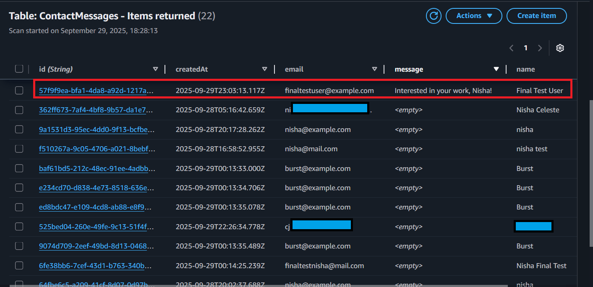

# Evidence Walkthrough

This walkthrough provides proof that the automated contact form system works **end-to-end**, starting from the public domain and finishing with persistent storage and email notifications. 

The evidence follows the same flow as the architecture:  

1. **Route 53 + CloudFront** deliver the static site securely over HTTPS.  
2. **S3 static site** hosts the contact form.  
3. **API Gateway + Lambda** process submissions and return data.  
4. **DynamoDB** stores leads for reliable tracking.  
5. **SES** delivers real-time email notifications.  

Each screenshot demonstrates a stage in the workflow, tied to the Problem → Approach → Result → Lesson framework.

---

## 0. Distribution Layer (Context)
Before demonstrating the workflow, we show how the static site is delivered to end users securely and reliably.

### CloudFront Distribution
Requests for the site are served through **Amazon CloudFront**, which points to the private S3 bucket as the origin.  
This provides HTTPS, caching for performance, and hides the bucket from direct public access.


---

### Route 53 DNS Record
The custom domain **theepicbooksofnisha.click** is managed in **Amazon Route 53**.  
An **A/ALIAS record** routes traffic to the CloudFront distribution, ensuring end users always resolve the site correctly.


---

### S3 Bucket with Origin Access
The static files (HTML, CSS, JS) are stored in an **Amazon S3 bucket**.  
The bucket does **not** have static website hosting enabled or public access.  
Instead, it is locked down and only accessible through the CloudFront origin access identity (OAI), enforcing a security-first design.


---

## 1. Form Submission (Problem)
Users often fill out contact forms on static sites, but without automation, these submissions may be missed or inconsistently tracked.  
Here we demonstrate a form submission from the hosted static site.  

  

---

## 2. DynamoDB Storage (Approach)
Our approach ensures every submission is automatically validated and persisted in DynamoDB via the **POST Lambda**.  
This provides reliable, queryable storage instead of relying on unstructured email inboxes.  

  

---

## 3. API Testing with cURL – POST

We verified the `POST` endpoint by sending a new lead directly to the API Gateway endpoint with `curl`.  
This confirms the **contact-us Lambda** correctly validates and stores submissions.

**Test Command:**

```bash
curl -i -X POST "https://w6ibd0d18e.execute-api.us-east-1.amazonaws.com/dev/epicreads_resource" \
  -H "Origin: https://theepicbooksofnisha.click" \
  -H "Content-Type: application/json" \
  -d '{"name":"Final Test User","email":"finaltestuser@example.com","message":"Interested in your work, Nisha!"}'
```
 


**Evidence:**  
- New entry appears in DynamoDB  
- SES notification email is delivered  
- Lead is retrievable with the `GET` test (next section)  

---

## 4. API Testing with cURL and API Gateway Console (Lesson, Part 2)

To confirm reliability and observability, the system was tested directly act the API layer.  
- The `GET` endpoint successfully returned stored submissions via **cURL**.  
- API Gateway console testing confirmed the **list_contacts Lambda** integration worked as designed.  

  
 

---

## 5. Admin Page – Contact Review (Lesson, Part 1)
To validate lessons learned about accessibility and operational ease, we created an **admin page (contacts.html)** that queries the API to retrieve stored contacts.  
This allows simple, centralized review of captured leads.  

  

---

## 6. SES Email Notification (Result)
Each submission triggers an **Amazon SES email notification**, ensuring stakeholders are alerted in real time.  
The screenshot below shows a delivered notification routed to Gmail.  

  

---

## Summary
The evidence above confirms the system works **end-to-end**:  
- **Problem:** Manual lead handling risks missed opportunities.  
- **Approach:** Automate submissions with AWS serverless services.  
- **Result:** Submissions are instantly stored, emailed, and retrievable.  
- **Lesson:** Serverless automation reduces operational overhead while ensuring leads are never lost.  
